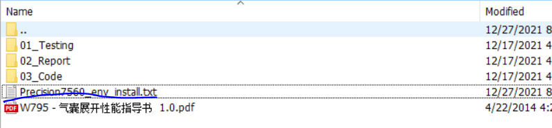
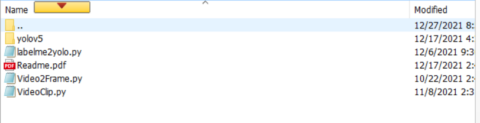
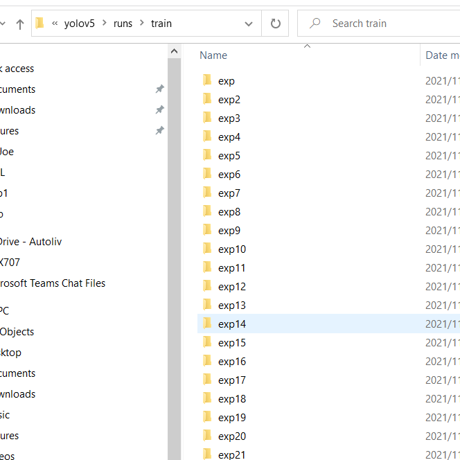
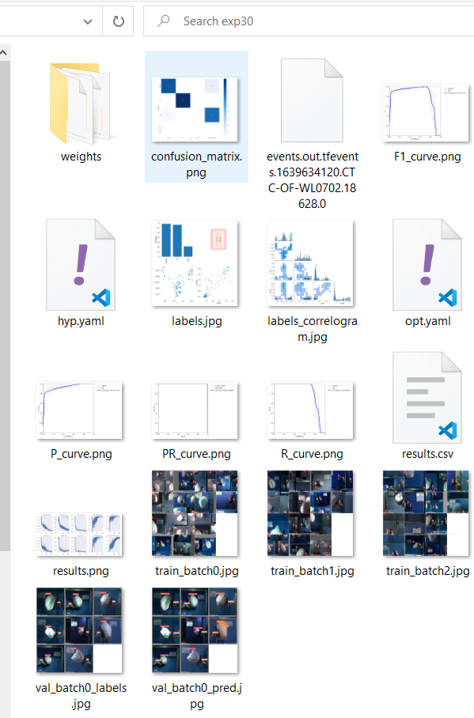
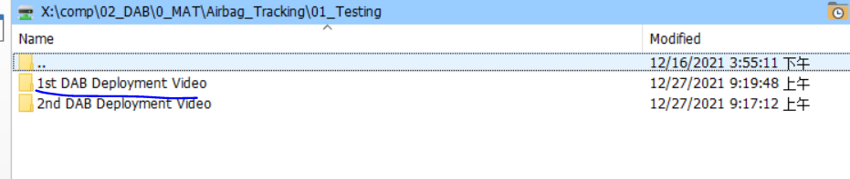
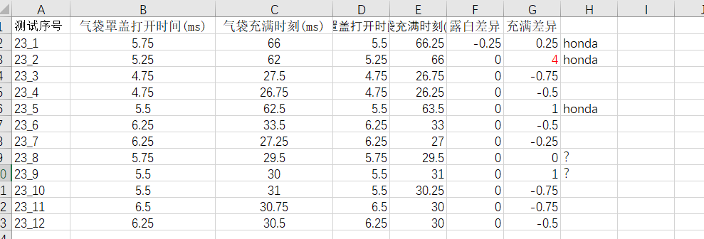

# Yolo训练及预测
## 环境配置
根目录下可以找到Precision7560_env_install.txt的文档，该文档是针对Dell Precision7560电脑配置的env，可以通过命令行输入`conda create --name <env> --file <this file>`进行环境配置。

其他小程序：

<mark>labelme2yolo.py</mark> 将labelme标注的信息转换成yolo的格式
<mark>Video2Frame.py</mark> 将视频每一帧图片抽取出来。
<mark>VideoClip.py </mark> 将视频进行裁剪640*640的图像，yoloV5目前的图像尺寸建议为32的倍数，默认值为640。
## 准备数据
1. 将视频文件存储为每一帧的图片，同时对图片进行裁剪。
配置好视频路径，运行<mark>VideoClip.py</mark>，会自动将视频每帧读入，并裁剪程640*640，并保存录像路径下的save_clip文件夹下。

```python
if __name__ == "__main__":
    video_path = r"C:/Yoking/01_Study/Yolo/Testing/fof/" #视频路径
    files = glob(video_path + "*.avi")
    files_name = [i.replace("\\", "/").split("/")[-1].split(".json")[0] for i in files]
    for i,video_dir in enumerate(files):
        print ("Video:",video_dir)
        video_name = files_name[i].replace(".avi","_clip.avi")
        videoclip(video_path,files_name[i],frameStart=0,frameEnd=700,scale=1,save_path=r"save_clip/")
        getFrame(video_path+r"save_clip/",video_name,save_path=r"save_frames/")
```
2.从裁剪好的图像中旋转具有代表性（气袋状态差异较大）的图像创建数据集。
3.采用Labelme对录像进行标注。
安装好labelme 后，便可运行<mark>labelme</mark>。
 
4.数据转换程yoloV5的数据
标注后会生成与图片对应的JSON文件，使用<mark>labelme2yolo.py</mark>进行标注文件的转换。
```python
if __name__ =="__main__":
    # 1.定义类别
    classes = ["foot","knee","head","hand"]
    # 2.标签路径
    labelme_path = r"C:/Yoking/01_Study/Yolo/Testing/fof/label/"
    isUseTest = True  # 是否创建test集
    #################################################################
    files = glob(labelme_path + "*.json")
    files = [i.replace("\\", "/").split("/")[-1].split(".json")[0] for i in files]
    print(files)
    if isUseTest:
        trainval_files, test_files = train_test_split(files, test_size=0.1, random_state=55)
    else:
        trainval_files = files
    # split
    train_files, val_files = train_test_split(trainval_files, test_size=0.1, random_state=55)

    wd = getcwd()
    print(wd)

    ChangeToYolo5(train_files,labelme_path, "train")
    ChangeToYolo5(val_files, labelme_path,"val")
    ChangeToYolo5(test_files, labelme_path,"test")
```
程序生成的文件夹如下图，tmp包含了训练集，测试集，验证集所需的图片。


5. 训练
* 配置<mark>train.py</mark>，并运行。
* 
```python
def parse_opt(known=False):
    parser = argparse.ArgumentParser()
    parser.add_argument('--weights', type=str, default=ROOT / 'yolov5n.pt', help='initial weights path')  #定义预训练模型
    parser.add_argument('--cfg', type=str, default=ROOT /'models/yolov5n_cushion.yaml', help='model.yaml path')#指定Yolo模型
    parser.add_argument('--data', type=str, default=ROOT / 'data/cushion.yaml', help='dataset.yaml path')#指定训练的数据集
    parser.add_argument('--hyp', type=str, default=ROOT / 'data/hyps/hyp.scratch.yaml', help='hyperparameters path')# 超参数，不建议修改
    parser.add_argument('--epochs', type=int, default=600)    #EPOCH尽量设置大一点。
    parser.add_argument('--batch-size', type=int, default=14, help='total batch size for all GPUs, -1 for autobatch') #尽量显卡上限
    parser.add_argument('--imgsz', '--img', '--img-size', type=int, default=640, help='train, val image size (pixels)')#默认即可
    parser.add_argument('--rect', action='store_true', help='rectangular training')#默认即可
    parser.add_argument('--resume', nargs='?', const=True, default=False, help='resume most recent training')#重启训练
    parser.add_argument('--nosave', action='store_true', help='only save final checkpoint')#默认即可
    parser.add_argument('--noval', action='store_true', help='only validate final epoch')#默认即可
    parser.add_argument('--noautoanchor', action='store_true', help='disable autoanchor check')#默认即可
    parser.add_argument('--evolve', type=int, nargs='?', const=300, help='evolve hyperparameters for x generations')#默认即可
    parser.add_argument('--bucket', type=str, default='', help='gsutil bucket')#默认即可
    parser.add_argument('--cache', type=str, nargs='?', const='ram', help='--cache images in "ram" (default) or "disk"')#默认即可
    parser.add_argument('--image-weights', action='store_true', help='use weighted image selection for training')#默认即可
    parser.add_argument('--device', default='', help='cuda device, i.e. 0 or 0,1,2,3 or cpu')#默认GPU
    parser.add_argument('--multi-scale', action='store_true', help='vary img-size +/- 50%%')#默认即可
    parser.add_argument('--single-cls', action='store_true', help='train multi-class data as single-class')#默认即可
    parser.add_argument('--adam', action='store_true', help='use torch.optim.Adam() optimizer')#默认即可
    parser.add_argument('--sync-bn', action='store_true', help='use SyncBatchNorm, only available in DDP mode')#默认即可
    parser.add_argument('--workers', type=int, default=8, help='maximum number of dataloader workers')#默认即可
    parser.add_argument('--project', default=ROOT / 'runs/train', help='save to project/name')#默认即可
    parser.add_argument('--name', default='exp', help='save to project/name')#默认即可
    parser.add_argument('--exist-ok', action='store_true', help='existing project/name ok, do not increment')#默认即可
    parser.add_argument('--quad', action='store_true', help='quad dataloader')#默认即可
    parser.add_argument('--linear-lr', action='store_true', help='linear LR')#默认即可
    parser.add_argument('--label-smoothing', type=float, default=0.0, help='Label smoothing epsilon')#默认即可
    parser.add_argument('--patience', type=int, default=100, help='EarlyStopping patience (epochs without improvement)')#默认即可
    parser.add_argument('--freeze', type=int, default=0, help='Number of layers to freeze. backbone=10, all=24')#迁移学习，默认即可
    parser.add_argument('--save-period', type=int, default=-1, help='Save checkpoint every x epochs (disabled if < 1)')#默认即可
    parser.add_argument('--local_rank', type=int, default=-1, help='DDP parameter, do not modify')#默认即可

    # Weights & Biases arguments
    parser.add_argument('--entity', default=None, help='W&B: Entity')#默认即可
    parser.add_argument('--upload_dataset', action='store_true', help='W&B: Upload dataset as artifact table')#默认即可
    parser.add_argument('--bbox_interval', type=int, default=-1, help='W&B: Set bounding-box image logging interval')#默认即可
    parser.add_argument('--artifact_alias', type=str, default='latest', help='W&B: Version of dataset artifact to use')#默认即可

    opt = parser.parse_known_args()[0] if known else parser.parse_args()
    return opt
```

* 配置文件data/cushion.yaml
指定训练用数据集存储路径。

* 配置models/yolov5n_cushion.yaml
仅仅指定类别数量即可。

6.训练结果查看。
训练后的模型可以再runs文件夹中找到，并再每个exp文件夹下weight中找到训练好的模型。


7.yoloV5 detect.py进行目标检测。
运行detect.py，关键参数如下图红线所示。
framestart 和 frameend：视频帧的起始和结束帧ID（非Yolo原生参数）。
weights：加载训练好的模型（.pt文件）。
imgsize：32 的倍数，图像默认大小，不会影响实际的目标检测。
conf-thres： 前景和背景置信度阈值。较大的数值会增加误判为背景的概率。
iou-thres：抑制iou较小的目标框。 较大的数值回赠目标框的数量。
```python
def parse_opt(video,video_path,framestart=40,frameend=300):
    parser = argparse.ArgumentParser()
    parser.add_argument('--weights', nargs='+', type=str, default=ROOT / 'best.pt', help='model path(s)') # 指定模型路径
    parser.add_argument('--source', type=str, default=video, help='file/dir/URL/glob, 0 for webcam') # 选择录像
    parser.add_argument('--imgsz', '--img', '--img-size', nargs='+', type=int, default=[640], help='inference size h,w') # 32 倍数，图像尺寸，默认无影响
    parser.add_argument('--conf-thres', type=float, default=0.3, help='confidence threshold') # 置信度阈值
    parser.add_argument('--iou-thres', type=float, default=0.1, help='NMS IoU threshold') #iou 阈值
    parser.add_argument('--max-det', type=int, default=1000, help='maximum detections per image') #最大检测目标数量，默认
    parser.add_argument('--device', default='', help='cuda device, i.e. 0 or 0,1,2,3 or cpu') # 选择GPU 还是 cpu
    parser.add_argument('--view-img', action='store_true', help='show results') # 默认
    parser.add_argument('--save-txt', action='store_true', help='save results to *.txt') # 默认
    parser.add_argument('--save-conf', action='store_true', help='save confidences in --save-txt labels') # 默认
    parser.add_argument('--save-crop', action='store_true', help='save cropped prediction boxes') # 默认
    parser.add_argument('--nosave', action='store_true', help='do not save images/videos') # 默认
    parser.add_argument('--classes', nargs='+', type=int, help='filter by class: --classes 0, or --classes 0 2 3') ## 默认
    parser.add_argument('--agnostic-nms', action='store_true', help='class-agnostic NMS') # 默认
    parser.add_argument('--augment', action='store_true', help='augmented inference') # 默认
    parser.add_argument('--visualize', action='store_true', help='visualize features')# 默认
    parser.add_argument('--update', action='store_true', help='update all models')# 默认
    parser.add_argument('--project', default=video_path, help='save results to project/name')# 默认
    # parser.add_argument('--project', default=ROOT / 'runs/detect', help='save results to project/name')
    parser.add_argument('--name', default='exp', help='save results to project/name')# 默认
    parser.add_argument('--exist-ok', action='store_true', help='existing project/name ok, do not increment')# 默认
    parser.add_argument('--line-thickness', default=3, type=int, help='bounding box thickness (pixels)')# 默认
    parser.add_argument('--hide-labels', default=False, action='store_true', help='hide labels')# 默认
    parser.add_argument('--hide-conf', default=False, action='store_true', help='hide confidences')# 默认
    parser.add_argument('--half', action='store_true', help='use FP16 half-precision inference')# 默认
    parser.add_argument('--dnn', action='store_true', help='use OpenCV DNN for ONNX inference')# 默认
    # Parameters for deployment video clip
    parser.add_argument('--framestart',  type=int, default=framestart, help='Crop frame start')# 视频起始帧
    parser.add_argument('--frameend',  type=int, default=frameend, help='Crop frame end')# 视频结束帧
    opt = parser.parse_args()
    opt.imgsz *= 2 if len(opt.imgsz) == 1 else 1  # expand
    # print_args(FILE.stem, opt)
    return opt
```
8. 气袋追踪主程序。
目前主程序放在detect.py中，用户只需在conda配置好的环境中直接运行`python detect.py`即可，也可以通过传参的形式运行该程序。
```python
t_start = time.time()# 统计时间
    print ("\n*****%s start*****" % (time.strftime("%X", time.localtime()))) # 打印开始时间
    video_path = r"C:/Users/yujin.wang/Desktop/DAB_deployment_video/LT/" #多个录像路径
    videolist  = glob(video_path+"/*") # 获得录像列表
    videolist = [r'C:/Users/yujin.wang/Desktop/DAB_deployment_video/HT/85_14/']  # 如果只针对一个T号，可以输入一个录像的路径
    for videoPath in videolist: #循环预测多个T号下的气袋

        print (videoPath) #打印T录像路径
        videoPath += '/'  #补全T录像路径
        # files = glob(video_path + "*.avi")
        detect_path = videoPath + r'detect/' #创建推测文件夹，如果存在则pass
        try:
            os.mkdir(detect_path) 
        except:
            pass
        files = glob(videoPath + "*.avi") #获得T号下录像
        for file in files:  #循环获得录像文件
            if "FRONT" in file or "REAR" in file: #如果是正面DAB点爆录像，则采用帧差法进行目标追踪，获得DAB点爆时刻
                front = subbg.CushionTracking([file],target=False,mp=True,resolution=0.025) # target=False,mp=True,resolution=0.025 三个参数已经舍弃，可以选择默认值。
                front.run()
                # print ("DAB deployment time: %f s" %(a.deployment_time))
            else:
                pass
        for file in files: #如果是侧面DAB点爆录像，则采用Yolo追踪
            if "SIDE" in file:
                    opt = parse_opt(file,detect_path,framestart=front.offframe,frameend=300) # 参数设定，包括录像视频
                    boxinfo,save_path = main(opt)                                            # YoloV5运行
            else:
                pass
        t0,t1 = deployment(boxinfo,save_path,deltaT=front.delta_t,deployment_time=front.deployment_time)  # 获得 两个时刻t0 露白时刻，t1 充满时刻
        filename = videoPath.replace("\\", "/").split("/")[-2]                                            # excel文件名， 将多个录像的预测结果放在一个csv录像中。
        predict.append([filename,t0,t1]) 
        t0,t1 =0,0
        timecost = round(time.time() - t_start,1)
        print ("*****%.3fs *****\n" % (timecost)) 
    predict = pd.DataFrame(predict)
    predict.to_csv(video_path+'predict.csv')
```
主要流程如下图所示。
* 关于气袋露白时刻的判断主要采用帧差法进行背景重建，获得运动物体的轮廓，并根据轮廓大小阈值进行筛选，获得DAB Cover的动态变化，从而判断露白时刻。黄色为<mark>subbg.py</mark>程序

* 通过YoloV5进行目标检测，缝线和气袋运动状态，气袋充满时刻的预测。蓝色为<mark>detect.py</mark>。
目前，主程序为<mark>detect.py</mark>。运行

## 实验数据整理
目前，有两批实验录像。当前的报告主要是针对第一次的实验进行的训练和测试，存放在01_Testing文件夹下。
人工预测分别由Qihe Xiao（前两列）和Aoife Zhou（houlianglie）完成。


## Labelme介绍及安装
[介绍](https://blog.csdn.net/u014061630/article/details/88756644)
[labelme的安装和使用](https://blog.csdn.net/c_daofeng/article/details/90211105)